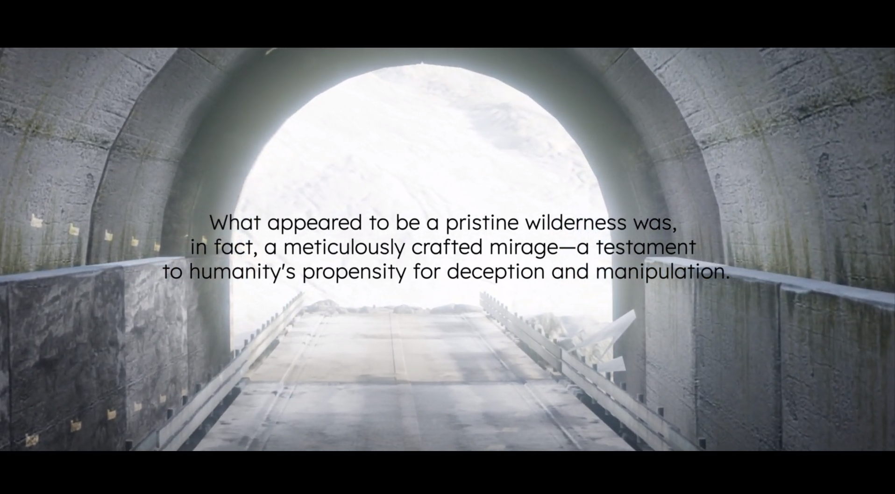
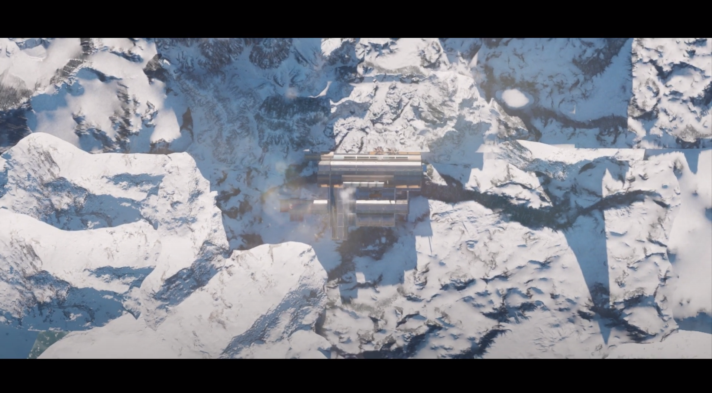
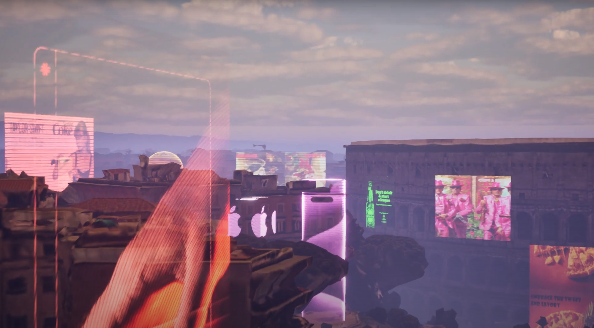

# IAAC 2024 |  COLLAPSE! Seminar - Syllabus

In recent years, the image of the world as a dynamic yet stable and predictable ecosystem has been disrupted and accelerated due to various breaks in different prediction patterns. Natural catastrophes, resource overmining, deforestation, desertification, food scarcity, mass migration, are all interconnected in one way or another, or at least all part of the same kind of crisis. However, the notion of ‘collapse’, in our case and as will be explored through the seminar, does not necessarily entail a downfall or an apocalyptic end, but rather the understanding that through continued accelerated modes of technologies, mediatization, and interactions across various architectural and urban scales everything is connected, entangled, and ‘collapsing’ into one another.

The seminar will emphasize narrative and worlding as a means to critically analyze pressing issues of our times, discussing themes through hashtags (see below), constructing potential realities which include buildings and landscapes, as well as finer grain details that reveal behaviors and overall atmospheres through the use of video game engines. Each group will select a specific city and examine its past, present, and future. Starting from a research-driven approach, a specific topic distinct to each city will be established and form the basis for determining what role architecture will play.

### introduction

 presentation and references 

### Presentation

- [collaps_presentation](./presentation/collapse.pdf)
- [syllabus](./presentation/syllabus.pdf)

### References
- [Collapse Seminar Full Syllabus](./references/23_24%20MAA01%20COLLAPSE!%20Seminar%20Full%20Syllabus.pdf)
- [A Bestiary of the Anthropocene Excerpt](./references/A_Bestiary_of_the_Anthropocene_EXCERPT.pdf)
- [When We Cease to Understand the World: Prussian Blue](./references/Benjamin%20Labatut_When%20we%20cease%20to%20understand%20the%20world_Prussian%20Blue.pdf)
- [Ecology After Capitalism](./references/Morton_Timothy-Ecology-After-Capitalism.pdf)
- [The Estranged Object X](./references/Young%2B%26%2BAyata_The%20Estranged%20Object_X.pdf)

### session_1

  
Blender Basics

  
  ## Shortcuts
  - **Select:** Right or left click
  - **Select all:** A
  - **Multiple objects can be selected with holding Shift**
  - **Move selection:** G
  - **Scale selection:** S
  - **Rotate selection:** R
  - **Move, scale, rotate along axis:** e.g., G X 90, R Y 10, S Z 2
  - **Use middle mouse button to control the axis during transformations**

  ## Edit Mode
  - **Enter edit mode:** Tab
  - **Switch selection mode:** 1 (vertices), 2 (edges), 3 (primitives)
  - **Enable proportional editing for manipulating geometry with a falloff radius**

  ## Adding Elements
  - **Add geometry, lights, cameras, etc.:** Shift + A

  ## Move Selection to Center
  1. **Shift + S -> Cursor to World Origin**
  2. **Shift + S -> Selection to Cursor**

  ## Render Engines
  Blender natively supports two rendering engines: Cycles and EEVEE.
  - **Cycles:** Pathtracer for photorealistic images, slower but with great camera options.
  - **EEVEE:** Game engine for fast results.

### session_2

  
blender Kitbashing and Texture Baking

  the video files can be found under "./courses/session_2"  
  The recording can be found: [Session 02 Recording](https://www.youtube.com/watch?v=E3SfIc2mfdo)

  ## Kitbashing
  - Copy a few kitbash pieces found under `./session_2/kitbash_x.blend` and paste them into an empty Blender file. The easiest way is to open two Blender instances and use "Ctrl+C" and "Ctrl+V" to paste into a new scene.
  - Select all objects and place them into the center of the scene with "Shift+S" -> Selection to Cursor.
  - Make a composition with the geometry.
  - Join the objects into one. Select all objects and press "Ctrl+J".

  ## Texture Painting
  - Unwrap the object by going into edit mode ("Tab") and then "U" -> "Smart UV Project".
  - Select the model and delete all corresponding materials. Do this by deleting the materials under "Material Properties".
  - Select the object and make a new diffuse material in the material editor, and add an image texture (with alpha set to 0).
  - Go into "Texture Paint" mode and see if you can paint with a color on the model.
  - When this works, open up a texture (`session_2/graffiti_textures/..`) under texture properties.
  - Under "Active Tool and Workspace Settings," change the tiling method to "Stencil". Now, a texture overlay should appear in the Blender viewport.
  - Using "Ctrl+Right Click," "Right Click," "Shift+Right Click," you can control the texture scale, location, and rotation.

  ## Texture Baking
  - If you are happy with your texture paint, we can now bake this texture. Baking a texture means that all light information is embedded into a texture. This means that the engine does not need to calculate the lights in real-time, which speeds up frames. This is as much a positive as it is a negative in some scenarios.
  - To bake a texture:
    - Select your model, open the material editor.
    - Add a new image texture, set the name and resolution.
    - Make sure to select the texture.
    - Under render properties, make sure you have set a low render sample size and press bake.
  - Export both your baked texture and your 3D model.
  - Now you can load them into the project folder in Unreal Engine.

### session_3

  
unreal tutorial

  - [Unreal Tutorial: reach_for_the_dead](https://www.youtube.com/watch?v=DR-J4Rljafc)

### Finals

  
PDFs and Videos

  #### PDFs
  - [Echoes of Tomorrow](echoes_of_tomorrow_presentation.pdf)
  - [Frozen Mirage](FROZEN_MIRAGE_Presentation.pdf)
  - [La Bolla](La_Bolla_presentation.pdf)
  - [Nusantara Forever](Nusantara_Forever_presentation.pdf)
  - [Quantum Uncanny](echoes_of_tomorrow_presentation.pdf)

  #### Videos
  - [Echoes of Tomorrow Video](https://www.youtube.com/watch?v=enLK4b4DlBM)
  - [Frozen Mirage Video](https://www.youtube.com/watch?v=dqVMF4jefiM)
  - [La Bolla Video](https://www.youtube.com/watch?v=mHTtsJVZex8)
  - [Nusantara Forever Video](https://www.youtube.com/watch?v=xClTBWFXPEc)
  - Quantum Uncanny Video link not available

### media

    
    
    
    
    
    
    
    
    
    
    
    
    
    
    
    
    
    
    
    

